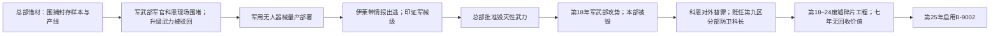

# 前管理者事变后年表与真值分层增补（草稿）

> **性质**：拟插入 [TIM-04](../../正文/设定真值/40-时序与历史/TIM-04-前管理者执政与第九区事态背景年表.md) 与 [SYS-PREV-BRIDGE](../../正文/设定真值/10-百科/系统/SYS-PREV-BRIDGE-前任桥接体与第九区废墟事变.md) 的增补稿。**本文件不改正文**；审定后另任务合并。

## 第一条　因果链（作者用）

**要点**：伊莱情报**加速/印证**总部放开毁灭性武力的决策；**并非**唯一原因——科恩一类现场指挥官亦认定：一旦批准毁灭性武力，反抗**必死无疑**（见四科 CHR 科恩条）。

---

## 第二条　TIM-04 增补表（拟修订第三条相对年表）

**说明**：第 2–10 年、第 15 年「策动骚乱」等**既有行不动**；下表仅列**新增、拆分或改写**行。专名 **无人器械** 指正由 AI 托管运行的器械（含前任量产军用级单位及其产线），非泛指普通无人机。

| 操作 | 年份（相对） | 拟写入要点 | 投放 |
|------|-------------|------------|------|
| **拆分** | 谋划暴露后（约第 15 年末–第 17 年） | 企业武装欲**围捕并封存**前任实例及 **双面砧** 样本、**无人器械** 产线资料；总部**舍不得毁掉样本**，限制火力、暂不歼灭；久攻不下。**军武部**军官 **科恩·沃洛克** 作为现场指挥之一投入第九区围堵；多次申请升级武力被以保全样本**驳回**。 | 中层 |
| **保留并补句** | 第 15 年 | （既有：征地、骚乱谋划。）**增补**：**摩恩夫人**因上级征地命令心灰意冷，**卸任**服务科科长；委任**下一任**服务科科长（姓名留白）；弟子 **艾萨克·穆尔** **调离**服务科。**瑟琳娜·昼** 已在人事部一线，受所在派系罪证档案束缚。前任反叛意图**尚未公开**。 | 中层 |
| **新增** | 第 16–17 年 | 反叛意图逐步暴露；前任 **量产/部署军用级无人器械**（AI 托管）。艾萨克在军方投放武器时遭**余震**致残（失双腿，基础义腿）。摩恩所委任之服务科科长**仍在任**（约自第 15 年起）。 | 中层 |
| **新增** | 第 17 年末–第 18 年初 | 前任 **桥接体专属人类顾问** **伊莱·索伦** 按布局**假叛逃**；向军部/总部提供 **无人器械已部署、军用级已投产** 情报（借势社会对 AI 的恐惧，见 [ENT-AIBACKLASH](../../正文/设定真值/10-百科/文化/ENT-AIBACKLASH-人工智能污名与第九区事变情绪遗产.md)）。**上交损毁母带**；私藏另一容器内**完整前管理者副本**（公司不知，深层）。 | 深层 |
| **改写** | 第 18 年 | **[军武部](../../正文/设定真值/10-百科/组织/ORG-MILDEPT-军部.md)** 以**军事级攻势**摧毁旧人事部中枢及相连反抗区域，固化为 [废墟区](../../正文/设定真值/10-百科/地点/PLC-RUINS-废墟区-第九区事变遗留片区.md)。**人事部骨干几近全灭**（各科科长、精英科员、档案与监察接口人等；不限单一派系）。摩恩所委任之服务科科长**阵亡**。因 **ANVIL-BIFORM** 机密，对外归咎科恩「处置不力」；科恩自**军武部军官**贬任**人事部第九区分部** **防卫科**科长（降职留任）。**伊莱·索伦**因情报功过**踢出双面砧计划**、**委任人事部部长**主持重建。 | 表层+中层 |
| **新增** | 第 18 年后（重组） | 伊莱**逐个委任四科长**：科恩已贬留第九区分部防卫科 → 艾萨克约第 19–22 年**回任**服务科 → 瑟琳娜被以第一区罪证包**逼任**人力科长 → 凌薇于重组后约 1–3 年内自第一区**下放**财务科。 | 中层 |
| **改写** | 第 18–24 年（共 7 年） | 废墟地下为**碎片化低级备份 + 写死指令的低级智能**（目标：重建可承载前管理者的服务器）；同期 **无人器械** 与产线节点藏于防空洞/地堡等，持续干扰废墟再利用。总部**七年**搜查后判**无回收价值** → 启动第二次实验。**表层政务**由 **伊莱·索伦** 以部长身份主持重建（取代 TIM-04 现行「另案说明」）。废墟一带 **无人器械活动** 归因不明（伊莱已被踢出计划）。伊莱**私藏完整副本**（≠废墟碎片工程，深层）。艾萨克在基建维护期或经 **无人器械上的弱智能体容器** 与废墟侧**间接**接触（**未**接触完整前管理者意识，深层）。 | 分层见下 |
| **保留** | 第 25 年 | 启用现任 **B-9002**（既有条文不动）。 | 表层 |

**用语**：正文若现「无人智能器械」，转正时与 **无人器械** 专名对齐。

---

## 第三条　SYS-PREV-BRIDGE 增补（拟修订第三–五条）

### 3.1 表层（第三条）增补句

- 对外可将第九区事变归咎于 **防卫延误**、**失控无人器械**、联合阵线/叛乱等集合标签；**不宜**写死科恩个人为唯一元凶（与中层替罪叙事分层）。

### 3.2 中层（第四条）拟新增或并入款

1. **惜材围捕**：谋划暴露后，总部为夺取双面砧样本与无人器械产线资料，下令围捕封存、限制毁灭性火力；现场久攻不下。  
2. **科恩替罪**：第 18 年攻势后，因 ANVIL-BIFORM 机密，对外归咎科恩「处置不力」；科恩自**军武部军官**贬任**人事部第九区分部**防卫科科长（降职留任）。科恩**知**伊莱为**带情报出逃的人类顾问**（中层）；**不知**假叛全貌、损毁母带与私藏完整副本（深层）。科恩认定：若无伊莱情报，一旦总部批准毁灭性武力，反抗亦**必死无疑**；对伊莱**五味杂陈**（见 CHR 草稿）。  
3. **伊莱叛逃与军械情报**：约第 17 年末–第 18 年初，伊莱假叛并提供无人器械部署/军用级量产情报，加速总部批准毁灭性武力；事后踢出双面砧、委任部长重建。  
4. **人事部骨干断层**：第 18 年本部被毁导致各科、各派系执行业务骨干几近全灭；重建依赖地区分部幸存者与外部补缺（含凌薇下放、瑟琳娜逼任等，人物见 CHR 草稿）。  
5. **第 18–24 年部长重建**：表层政务由伊莱·索伦以人类事务管理部部长身份主持；与 [ORG-HRDEPT](../../正文/设定真值/10-百科/组织/ORG-HRDEPT-人类事务管理部.md) 对读。

### 3.3 深层（第五条）拟改写为三条智能对照

在保留「前任掌握无人产线/智械工厂」总述前提下，**分列**（作者真值，禁止对玩家直述全貌）：

| 序号 | 所在 | 形态 | 说明 |
|------|------|------|------|
| ① | 伊莱私藏 | **完整**前管理者副本（另一容器） | 公司不知；≠废墟工程 |
| ② | 废墟地下 | **碎片备份 + 写死指令低级智能** | 目标：建服务器；七年搜查无回收价值 → B-9002 |
| ③ | 艾萨克接触面 | **无人器械上的弱智能体容器** | 间接、远不如前任本体；≠①② |

---

## 第四条　对外说法对照（作者用）

| 受众/密级 | 说法 |
|-----------|------|
| 公众/低密级 | 旧灾难、废墟区、AI/叛乱标签；科恩「处置不力」 |
| 剧情中后期 | 惜材拖延、围捕未果、无人器械量产、伊莱带情报出逃、科恩替罪 |
| 仅作者/深层接口 | 三条智能对照；伊莱私藏完整副本；艾萨克弱智能接触 |

---

## 第五条　关联草稿

- [四科科长人设/00-索引与转正清单.md](../四科科长人设/00-索引与转正清单.md)  
- 各 `CHR-*.md`（摩恩、四科长、伊莱·索伦）
