← [草稿](./README.md)

**校验状态**：待校验  
**最后更新**：2026-06-29  
**来源**：基于 [02-系统设计/](../02-系统设计/) 已收束内容生成；未覆盖待细化开放项与未同步草稿。  
**同步**：2026-06-29 初稿；对照 [需求-简历窗口与交互](../02-系统设计/02-需求/需求-简历窗口与交互.md)、[需求-界面与弹窗](../02-系统设计/02-需求/需求-界面与弹窗.md)、[需求-消息系统-邮件聊天日志](../02-系统设计/02-需求/需求-消息系统-邮件聊天日志.md)。

# 导出

```mermaid
flowchart TD
  n0["交互链"]

  subgraph sgInput ["输入与观察"]
    n1["输入与观察"]
    n2["鼠标点击"]
    n3["地图任务方块"]
    n4["简历员工身份牌"]
    n5["消息终端 Tab"]
    n6["底部 Win 按钮"]
    n7["UI 命中屏蔽底层"]
    n8["主场景无场景切换"]
    n9["地图为信息界面非开放世界"]
    n1 --> n2
    n2 --> n3
    n2 --> n4
    n2 --> n5
    n2 --> n6
    n5 --> n7
    n1 --> n8
    n1 --> n9
  end

  subgraph sgNav ["底部导航交互"]
    n10["底部导航交互"]
    n11["点击 Win 图标"]
    n12["展开四主按钮"]
    n13["快速存档"]
    n14["管理存档槽位"]
    n15["设置子页音量分辨率"]
    n16["关机退出或返回主菜单"]
    n17["子页关闭回展开态"]
    n18["消息 Tab 不丢 Win 展开"]
    n10 --> n11
    n11 --> n12
    n12 --> n13
    n12 --> n14
    n12 --> n15
    n12 --> n16
    n10 --> n17
    n10 --> n18
  end

  subgraph sgResume ["招聘与人事交互"]
    n19["招聘与人事交互"]
    n20["打开简历窗口"]
    n21["列表浏览与详情"]
    n22["拖拽排序与插卡动画"]
    n23["选中高亮"]
    n24["录用生成员工实例"]
    n25["证件照 Portrait 渲染"]
    n26["分配员工到委托职位"]
    n27["解除分配或开除"]
    n28["赔偿金计算"]
    n29["无法放置回收待命区"]
    n30["IdleArea 一键整理"]
    n19 --> n20
    n20 --> n21
    n20 --> n22
    n20 --> n23
    n20 --> n24
    n24 --> n25
    n19 --> n26
    n19 --> n27
    n27 --> n28
    n19 --> n29
    n29 --> n30
  end

  subgraph sgAssignUI ["委托面板交互"]
    n31["委托面板交互"]
    n32["地图 X 标记或方块点击"]
    n33["打开任务面板"]
    n34["查看进度与职位"]
    n35["开始 StorySeries 系列"]
    n36["叫停任务等于失败"]
    n37["接取日常委托"]
    n38["分配员工到槽位"]
    n39["面板字段实时刷新"]
    n40["阶段 hook 弹窗"]
    n31 --> n32
    n32 --> n33
    n33 --> n34
    n33 --> n35
    n33 --> n36
    n33 --> n37
    n33 --> n38
    n33 --> n39
    n33 --> n40
  end

  subgraph sgExec ["后台执行链"]
    n41["后台执行链"]
    n42["门控放行后创建命令"]
    n43["AssignmentController Tick"]
    n44["读取员工工作状态"]
    n45["分支树判定"]
    n46["任务内效果引擎"]
    n47["压力增量桥接"]
    n48["矛盾累积桥接"]
    n49["终态消息广播"]
    n50["经济结算"]
    n41 --> n42
    n42 --> n43
    n43 --> n44
    n43 --> n45
    n45 --> n46
    n46 --> n47
    n46 --> n48
    n43 --> n49
    n49 --> n50
  end

  subgraph sgMsg ["消息终端交互"]
    n51["消息终端交互"]
    n52["切换邮件聊天日志 Tab"]
    n53["邮件列表到详情到结果页"]
    n54["标记已读与存档"]
    n55["聊天频道列表"]
    n56["置顶未读最近消息排序"]
    n57["ChatStory 剧情播放"]
    n58["历史读档恢复"]
    n59["DialogNode 线性出消息"]
    n60["遇选项暂停等待"]
    n61["选项回填玩家气泡"]
    n51 --> n52
    n52 --> n53
    n53 --> n54
    n52 --> n55
    n55 --> n56
    n52 --> n57
    n57 --> n58
    n57 --> n59
    n59 --> n60
    n60 --> n61
  end

  subgraph sgCrisis ["危机协调交互"]
    n62["危机协调交互"]
    n63["压力分段变化 UI 响应"]
    n64["压力事件弹窗或邮件"]
    n65["任务 Scoped 效果可见"]
    n66["矛盾事件生成通知"]
    n67["打开协调面板"]
    n68["玩家选择结算选项"]
    n69["幂等扣款发奖"]
    n70["涉事员工状态恢复"]
    n71["ConflictMailBridge 后续"]
    n62 --> n63
    n63 --> n64
    n64 --> n65
    n62 --> n66
    n66 --> n67
    n67 --> n68
    n68 --> n69
    n68 --> n70
    n68 --> n71
  end

  subgraph sgPopup ["弹窗与优先级"]
    n72["弹窗与优先级"]
    n73["AssignmentEventPopupView"]
    n74["同类型不叠多个"]
    n75["关闭后恢复底层交互"]
    n76["对话播放中玩法弹窗排队"]
    n77["或抑制直到对话结束"]
    n78["未绑定页面占位不抛异常"]
    n72 --> n73
    n73 --> n74
    n73 --> n75
    n72 --> n76
    n76 --> n77
    n72 --> n78
  end

  subgraph sgTrigger ["系统间触发关系"]
    n79["系统间触发关系"]
    n80["人事链"]
    n81["录用增员工池"]
    n82["标签 Buff 改速度与薪资"]
    n83["分配改委托产出"]
    n84["运转链"]
    n85["日结刷新日常池"]
    n86["委托终态改资金"]
    n87["阶段 hook 发消息"]
    n88["张力链"]
    n89["压力注入任务效果"]
    n90["压力可推高任务矛盾"]
    n91["矛盾拖慢委托产出"]
    n92["叙事链"]
    n93["消息已读写进度"]
    n94["进度解锁科室与任务库"]
    n79 --> n80
    n80 --> n81
    n81 --> n82
    n82 --> n83
    n79 --> n84
    n84 --> n85
    n84 --> n86
    n84 --> n87
    n79 --> n88
    n88 --> n89
    n89 --> n90
    n90 --> n91
    n79 --> n92
    n92 --> n93
    n93 --> n94
  end

  subgraph sgSave ["存档交互链"]
    n95["存档交互链"]
    n96["Win 快速存档"]
    n97["采集各模块钩子"]
    n98["写盘 schema_version"]
    n99["管理存档选择槽位"]
    n100["读档按序恢复"]
    n101["恢复后继续 Tick"]
    n95 --> n96
    n96 --> n97
    n97 --> n98
    n95 --> n99
    n99 --> n100
    n100 --> n101
  end

  subgraph sgMap ["地图定位交互"]
    n102["地图定位交互"]
    n103["预置地点表"]
    n104["委托绑定 location_id"]
    n105["未绑定随机选取"]
    n106["进行中显示标记"]
    n107["终态隐藏标记"]
    n108["点击跳转任务面板"]
    n102 --> n103
    n103 --> n104
    n104 --> n105
    n104 --> n106
    n106 --> n107
    n106 --> n108
  end

  n0 --> n1
  n0 --> n10
  n0 --> n19
  n0 --> n31
  n0 --> n41
  n0 --> n51
  n0 --> n62
  n0 --> n72
  n0 --> n79
  n0 --> n95
  n0 --> n102
  n26 --> n38
  n38 --> n41
  n40 --> n72
  n47 --> n63
  n48 --> n66
  n87 --> n51
  n59 --> n76
  n108 --> n33
  n13 --> n95
```

