← [草稿](./README.md)

**校验状态**：待校验  
**最后更新**：2026-06-29  
**来源**：基于 [02-系统设计/](../02-系统设计/) 与 [02-运行时逻辑/](../03-程序设计/02-运行时逻辑/) 已收束内容生成；未覆盖待细化开放项。  
**同步**：2026-06-29 初稿；对照 [日结与门控管线](../03-程序设计/02-运行时逻辑/日结与门控管线.md)、[委托Tick与分支判定](../03-程序设计/02-运行时逻辑/委托Tick与分支判定.md)。

# 导出

```mermaid
flowchart TD
  n0["游戏流程"]

  subgraph sgTime ["两级时间尺度"]
    n1["两级时间尺度"]
    n2["现实秒级"]
    n3["虚拟日 Tick"]
    n4["默认 60 秒等于 1 游戏日"]
    n5["日级"]
    n6["日结扣薪"]
    n7["日常委托刷新"]
    n8["矛盾日终超时"]
    n9["长期"]
    n10["剧情进度推进"]
    n11["科室协助解锁"]
    n12["系列常驻委托跨度"]
    n1 --> n2
    n2 --> n3
    n2 --> n4
    n1 --> n5
    n5 --> n6
    n5 --> n7
    n5 --> n8
    n1 --> n9
    n9 --> n10
    n9 --> n11
    n9 --> n12
  end

  subgraph sgBoot ["启动与门控"]
    n13["启动与门控"]
    n14["EventBusBootstrap Awake"]
    n15["RuntimeMessageHub Install"]
    n16["RuntimeInitializationCompletedEvent"]
    n17["携带 gateKey"]
    n18["AssignmentManager 订阅放行"]
    n19["拒绝未门控创建命令"]
    n20["测试 Bootstrap 可模拟"]
    n13 --> n14
    n14 --> n15
    n15 --> n16
    n16 --> n17
    n16 --> n18
    n18 --> n19
    n13 --> n20
  end

  subgraph sgLoop ["一局主循环"]
    n21["一局主循环"]
    n22["招募与管理员工"]
    n23["接取与分配委托"]
    n24["任务自动推进"]
    n25["处理压力与矛盾事件"]
    n26["阅读邮件聊天对话"]
    n27["日结与资金结算"]
    n28["刷新日常委托"]
    n29["循环闭合"]
    n21 --> n22
    n21 --> n23
    n21 --> n24
    n21 --> n25
    n21 --> n26
    n21 --> n27
    n27 --> n28
    n28 --> n29
    n29 --> n22
  end

  subgraph sgDay ["日结管线"]
    n30["日结管线"]
    n31["PlayerEconomySystem Tick"]
    n32["检测跨天"]
    n33["OnDayChanged 广播"]
    n34["日薪扣除"]
    n35["终态任务结算"]
    n36["AssignmentDailyRefreshPublisher"]
    n37["发布 3 条日常委托"]
    n38["池为空 LogWarning"]
    n39["矛盾日终超时检查"]
    n30 --> n31
    n31 --> n32
    n32 --> n33
    n33 --> n34
    n33 --> n35
    n33 --> n36
    n36 --> n37
    n36 --> n38
    n33 --> n39
  end

  subgraph sgAssign ["委托推进子循环"]
    n40["委托推进子循环"]
    n41["CreateAssignmentCommandEvent"]
    n42["实例工厂读模板与分支树"]
    n43["注册运行时实例"]
    n44["AssignmentController Tick"]
    n45["EmployeeWorkStateResolver"]
    n46["职位进度综合速度"]
    n47["Branch Tree Rule Solver"]
    n48["TaskInteractionEffectEngine"]
    n49["Stress Conflict Message 桥接"]
    n50["完成失败过期终态"]
    n51["经济模块幂等结算"]
    n40 --> n41
    n41 --> n42
    n42 --> n43
    n43 --> n44
    n44 --> n45
    n45 --> n46
    n44 --> n47
    n47 --> n48
    n48 --> n49
    n44 --> n50
    n50 --> n51
  end

  subgraph sgStress ["压力事件流"]
    n52["压力事件流"]
    n53["委托进行中增量"]
    n54["ApplyStressDelta 聚合"]
    n55["分段跨越通知"]
    n56["达阈值选模板"]
    n57["性格 ID 匹配候选"]
    n58["去重键防轰炸"]
    n59["任务 Scoped 临时效果"]
    n60["满值性格失控"]
    n61["邮件与员工状态桥接"]
    n62["可向任务注入矛盾"]
    n52 --> n53
    n53 --> n54
    n54 --> n55
    n55 --> n56
    n56 --> n57
    n56 --> n58
    n54 --> n59
    n54 --> n60
    n56 --> n61
    n60 --> n62
  end

  subgraph sgConflict ["矛盾事件流"]
    n63["矛盾事件流"]
    n64["任务内矛盾累积"]
    n65["压力与标签驱动"]
    n66["达阈值模板池选取"]
    n67["权重与去重"]
    n68["生成矛盾事件"]
    n69["涉事员工 InConflictEvent"]
    n70["玩家协调结算"]
    n71["结算幂等"]
    n72["邮件桥接投递"]
    n73["冷却与日终超时"]
    n63 --> n64
    n64 --> n65
    n65 --> n66
    n66 --> n67
    n66 --> n68
    n68 --> n69
    n68 --> n70
    n70 --> n71
    n68 --> n72
    n68 --> n73
  end

  subgraph sgNarr ["叙事投递流"]
    n74["叙事投递流"]
    n75["阶段 hook 触发"]
    n76["邮件 MailDispatch"]
    n77["聊天 ChatStory"]
    n78["DialogNode 播放"]
    n79["选项写入会话记忆"]
    n80["story_progress 更新"]
    n81["解锁 gates 刷新池"]
    n74 --> n75
    n75 --> n76
    n75 --> n77
    n75 --> n78
    n78 --> n79
    n79 --> n80
    n80 --> n81
  end

  subgraph sgSave ["存档加载流"]
    n82["存档加载流"]
    n83["底部导航触发存读"]
    n84["schema_version 校验"]
    n85["经济恢复"]
    n86["员工恢复"]
    n87["委托恢复"]
    n88["消息恢复"]
    n89["矛盾压力恢复"]
    n90["对话记忆恢复"]
    n91["RuntimeInitializationCompletedEvent 顺序待定"]
    n82 --> n83
    n83 --> n84
    n84 --> n85
    n85 --> n86
    n86 --> n87
    n87 --> n88
    n88 --> n89
    n89 --> n90
    n90 --> n91
  end

  subgraph sgSeries ["系列委托流"]
    n92["系列委托流"]
    n93["玩家主动开始 StorySeries"]
    n94["分配员工到职位"]
    n95["Tick 跨日推进"]
    n96["玩家可随时叫停"]
    n97["叫停等于失败终态"]
    n98["环节重试计数"]
    n99["超限按失败处理"]
    n92 --> n93
    n93 --> n94
    n94 --> n95
    n95 --> n96
    n96 --> n97
    n95 --> n98
    n98 --> n99
  end

  n0 --> n1
  n0 --> n13
  n0 --> n21
  n0 --> n30
  n0 --> n40
  n0 --> n52
  n0 --> n63
  n0 --> n74
  n0 --> n82
  n0 --> n92
  n16 --> n40
  n33 --> n28
  n27 --> n30
  n49 --> n52
  n49 --> n63
  n62 --> n64
  n50 --> n27
  n81 --> n28
```

