← [草稿](./README.md)

**校验状态**：待校验  
**最后更新**：2026-06-29  
**来源**：基于 [02-系统设计/](../02-系统设计/) 已收束内容生成；未覆盖待细化开放项与未同步草稿。  
**同步**：2026-06-29 初稿；对照 [玩法介绍](../02-系统设计/01-游戏概述/玩法介绍.md)、[02-需求](../02-系统设计/02-需求/README.md) 与 [核心系统与核心循环](../03-程序设计/01-架构总览/核心系统与核心循环.md)。

# 导出

```mermaid
flowchart TD
  n0["神人事部 · 系统设计"]

  subgraph sg01 ["01-产品"]
    n1["01-产品"]
    n2["产品愿景与边界"]
    n3["人事调度与危机管理"]
    n4["效率成本人情压力平衡"]
    n5["目标玩家与会话时长"]
    n6["非目标与版本策略"]
    n1 --> n2
    n2 --> n3
    n2 --> n4
    n1 --> n5
    n1 --> n6
  end

  subgraph sg02 ["01-游戏概述"]
    n7["01-游戏概述"]
    n8["玩法介绍"]
    n9["玩家扮演人事部管理者"]
    n10["核心循环摘要"]
    n11["主要玩法系统索引"]
    n7 --> n8
    n8 --> n9
    n8 --> n10
    n8 --> n11
  end

  subgraph sgHR ["人事线"]
    n12["人事线"]
    n13["简历 Resume"]
    n14["列表与详情"]
    n15["拖拽排序与插卡"]
    n16["员工 Employee"]
    n17["能力状态标签"]
    n18["闲置委托中矛盾中离职"]
    n19["标签 Buff 聚合"]
    n20["能力日薪效率压力通道"]
    n21["证件照 Portrait"]
    n22["分层配置生成"]
    n23["待命区 IdleArea"]
    n24["身份牌兜底收纳"]
    n25["一键整理布局"]
    n12 --> n13
    n13 --> n14
    n13 --> n15
    n12 --> n16
    n16 --> n17
    n16 --> n18
    n16 --> n19
    n19 --> n20
    n12 --> n21
    n21 --> n22
    n12 --> n23
    n23 --> n24
    n23 --> n25
  end

  subgraph sgRun ["运转线"]
    n26["运转线"]
    n27["委托 Assignment"]
    n28["模板创建实例"]
    n29["Tick 推进阶段"]
    n30["分支树裁决终态"]
    n31["任务内交互效果"]
    n32["日常 StorySeries Event"]
    n33["叫停视为失败"]
    n34["环节重试上限"]
    n35["阶段 hook 驱动叙事"]
    n36["玩家经济 PlayerEconomy"]
    n37["虚拟日与 60 秒比 1 日"]
    n38["资金与日结扣薪"]
    n39["任务终态结算幂等"]
    n40["玩家性格标签"]
    n41["日常委托刷新"]
    n42["日结发布 N 等于 3"]
    n43["已解锁 Daily 模板池"]
    n44["地图与任务布点"]
    n45["预置地点集合"]
    n46["进行中 X 标记"]
    n47["点击打开任务面板"]
    n26 --> n27
    n27 --> n28
    n27 --> n29
    n27 --> n30
    n27 --> n31
    n27 --> n32
    n27 --> n33
    n27 --> n34
    n27 --> n35
    n26 --> n36
    n36 --> n37
    n36 --> n38
    n36 --> n39
    n36 --> n40
    n26 --> n41
    n41 --> n42
    n41 --> n43
    n26 --> n44
    n44 --> n45
    n44 --> n46
    n44 --> n47
  end

  subgraph sgTension ["张力线"]
    n48["张力线"]
    n49["压力 Stress"]
    n50["绑定员工"]
    n51["ApplyStressDelta 统一入口"]
    n52["分段 Tier 变化通知"]
    n53["压力事件去重"]
    n54["任务范围内临时效果"]
    n55["满值性格失控"]
    n56["矛盾 Conflict"]
    n57["绑定任务"]
    n58["任务内矛盾累积"]
    n59["阈值生成矛盾事件"]
    n60["玩家协调结算幂等"]
    n61["涉事员工 InConflictEvent"]
    n62["冷却去重日终超时"]
    n63["矛盾与压力事件选取"]
    n64["性格匹配模板池"]
    n65["权重选取避免重复"]
    n66["压力可注入任务矛盾"]
    n48 --> n49
    n49 --> n50
    n49 --> n51
    n49 --> n52
    n49 --> n53
    n49 --> n54
    n49 --> n55
    n48 --> n56
    n56 --> n57
    n56 --> n58
    n56 --> n59
    n56 --> n60
    n56 --> n61
    n56 --> n62
    n48 --> n63
    n63 --> n64
    n63 --> n65
    n49 --> n66
    n66 --> n58
  end

  subgraph sgTerminal ["终端线"]
    n67["终端线"]
    n68["消息 MessageSystem"]
    n69["邮件列表详情结果页"]
    n70["聊天频道与历史"]
    n71["置顶未读最近消息排序"]
    n72["日志视图"]
    n73["运行时收件与已读"]
    n74["对话 DialogSystem"]
    n75["DialogNode 线性播放"]
    n76["遇选项暂停"]
    n77["会话记忆与已选节点"]
    n78["与聊天 UI 集成"]
    n67 --> n68
    n68 --> n69
    n68 --> n70
    n68 --> n71
    n68 --> n72
    n68 --> n73
    n67 --> n74
    n74 --> n75
    n74 --> n76
    n74 --> n77
    n74 --> n78
  end

  subgraph sgShell ["界面壳层"]
    n79["界面壳层"]
    n80["底部导航 UI_Navigation"]
    n81["Win 展开四主按钮"]
    n82["存档设置关机子页"]
    n83["界面与弹窗 UI_Shell"]
    n84["事件弹窗排队"]
    n85["对话中玩法弹窗抑制"]
    n86["主菜单与场景流"]
    n87["首版主场景加底部导航"]
    n88["无独立 Title 场景"]
    n79 --> n80
    n80 --> n81
    n80 --> n82
    n79 --> n83
    n83 --> n84
    n83 --> n85
    n79 --> n86
    n86 --> n87
    n86 --> n88
  end

  subgraph sgCross ["跨模块与进度"]
    n89["跨模块与进度"]
    n90["存档与进度 SaveProgress"]
    n91["统一编排与槽位"]
    n92["读档顺序经济员工委托消息"]
    n93["schema_version 校验"]
    n94["剧情进度 StoryProgress"]
    n95["story_progress 字段"]
    n96["解锁 gates 驱动池与导航"]
    n97["科室协助解锁 DepartmentUnlock"]
    n98["财务人力防卫三科 flags"]
    n99["协助委托模板入口"]
    n89 --> n90
    n90 --> n91
    n90 --> n92
    n90 --> n93
    n89 --> n94
    n94 --> n95
    n94 --> n96
    n89 --> n97
    n97 --> n98
    n97 --> n99
  end

  subgraph sgInfra ["基础设施"]
    n100["基础设施"]
    n101["核心消息 CoreMessaging"]
    n102["全局事件总线"]
    n103["RuntimeInitializationCompletedEvent"]
    n104["gateKey 启动门控"]
    n105["数据资产 DataAssets"]
    n106["Assets/04_Data/"]
    n107["SO 模板与测试隔离"]
    n108["编辑器工具链 EditorTools"]
    n109["神人事部菜单前缀"]
    n110["运行时测试辅助 RuntimeTests"]
    n111["Bootstrap 门控闭环"]
    n100 --> n101
    n101 --> n102
    n101 --> n103
    n101 --> n104
    n100 --> n105
    n105 --> n106
    n105 --> n107
    n100 --> n108
    n108 --> n109
    n100 --> n110
    n110 --> n111
  end

  n0 --> n1
  n0 --> n7
  n0 --> n12
  n0 --> n26
  n0 --> n48
  n0 --> n67
  n0 --> n79
  n0 --> n89
  n0 --> n100
  n13 --> n16
  n16 --> n27
  n27 --> n49
  n27 --> n56
  n49 --> n68
  n56 --> n68
  n35 --> n68
  n35 --> n74
  n41 --> n27
  n44 --> n27
  n101 --> n27
  n101 --> n36
  n94 --> n41
  n94 --> n97
  n90 --> n94
```

