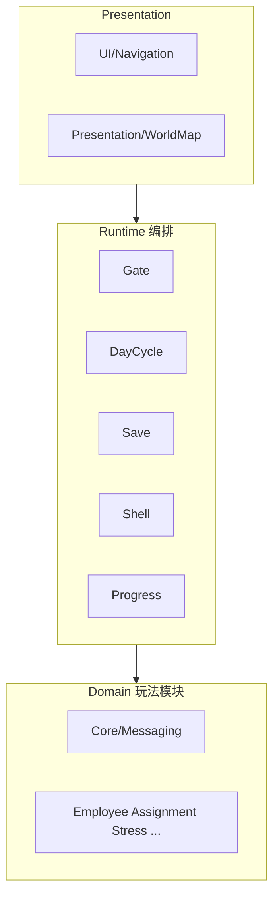

# 程序模块与文档结构

| 字段 | 内容 |
|------|------|
| 状态 | 已定稿（基线） |
| 最后更新 | 2026-06-30 |
| 关联 | [核心系统与核心循环](核心系统与核心循环.md)、[文档配对索引](../文档配对索引.md)、[01-草稿/系统设计详情图](../../01-草稿/系统设计详情图.md) |

本文说明：**代码模块**如何分文件夹，以及**程序设计文档**如何按层阅读。架构重组后增加 **Runtime 编排层** 与 **Presentation 表现壳层**，与三张详情图对齐。

---

## 一、分层架构

| 层 | 路径 | 程序集 | 职责 |
|----|------|--------|------|
| Core | `Core/Messaging/` | `ShenRenShibu.Core` | 全局总线、门控消息 |
| Domain | 各玩法模块目录 | `ShenRenShibu.Domain` | 业务规则、SO 模型、模块 View |
| Runtime | `Runtime/` | `ShenRenShibu.Runtime` | 跨模块执行顺序、存档/进度编排 |
| Presentation | `Presentation/` | `ShenRenShibu.Presentation` | 地图目录、后续壳层视图适配 |
| Editor | `Editor/` | `ShenRenShibu.Editor` | 菜单与 Inspector |

详情图对照：[系统设计详情图](../../01-草稿/系统设计详情图.md)、[流程设计详情图](../../01-草稿/流程设计详情图.md)、[交互链详情图](../../01-草稿/交互链详情图.md)。

---

## 二、代码模块（Domain）

| 模块键 | 路径 `Assets/01_Scripts/` | 职责 |
|--------|---------------------------|------|
| CoreMessaging | `Core/Messaging/` | 全局消息总线、启动门控 |
| RuntimeOrchestration | `Runtime/` | 日结/门控/存档/弹窗编排（见 [实现-运行时编排](../04-实现/实现-运行时编排.md)） |
| PlayerEconomy | `PlayerState/` | 资金、日历时钟、日结 |
| Employee | `Employee/` | 员工数据、状态、标签 Buff |
| Assignment | `Assignment/` | 委托 Tick、分支、任务交互效果 |
| Conflict | `ConflictSystem/` | 矛盾累积、模板、邮件桥接 |
| Stress | `StressSystem/` | 压力分段、事件、邮件桥接 |
| MessageSystem | `MessageSystem/` | 邮件 / 聊天 / 日志 UI 与 SO |
| DialogSystem | `DialogSystem/` | 对话节点播放 |
| Resume | `Resume/` | 简历窗口、拖拽、排序 |
| Portrait | `Portrait/` | 证件照生成与分层 |
| IdleArea | `IdleArea/` | 待命区收纳 |
| UI_Navigation | `UI/Navigation/` | 底部导航壳 |
| UI_Shell | `Runtime/Shell/` | 弹窗优先级（见 [实现-界面壳层](../04-实现/实现-界面壳层.md)） |
| WorldMap | `Presentation/WorldMap/` | 地点目录（见 [实现-地图与任务布点](../04-实现/实现-地图与任务布点.md)） |
| SaveProgress | `Runtime/Save/` | 战役存档编排 |
| StoryProgress | `Runtime/Progress/` | 剧情进度 stub |
| DepartmentUnlock | `Runtime/Progress/` | 科室解锁 flags stub |
| EditorTools | `Editor/` | 菜单、Inspector、场景工具 |
| RuntimeTests | `Tests/Runtime/`、`Tests/PlayMode/`、`Tests/Editor/` | 运行时验收辅助 |
| DataAssets | `04_Data/` | SO、对话与邮件库 |

模块依赖摘要见 [计划-模块依赖与建议顺序](../../02-系统设计/03-计划/计划-模块依赖与建议顺序.md)。

### 与机魂 Assembly 的对照

| 机魂 | 神人事部（2026-06-30） | 说明 |
|------|------------------------|------|
| `Game.Core` | `ShenRenShibu.Core` | 已拆出 |
| `Game.Simulation` | Domain 各模块 | 委托 Tick 仍在 Assignment |
| `Game.Presentation` | `ShenRenShibu.Presentation` + 各模块 `View/` | 逐步收敛壳层 |
| Glue / 编排 | `ShenRenShibu.Runtime` | 对应流程/交互链详情图 |

---

## 三、文档：「实现-*」按模块命名

| 文档类型 | 路径模式 |
|----------|----------|
| 需求 | `Docs/02-系统设计/02-需求/需求-<模块>.md` |
| 实现 | `Docs/03-程序设计/04-实现/实现-<模块>.md` |
| 运行时逻辑 | `Docs/03-程序设计/02-运行时逻辑/*.md` |
| 追溯 | `Docs/03-程序设计/05-交付/交付-追溯矩阵.md` |

跨模块执行顺序见 [02-运行时逻辑](../02-运行时逻辑/README.md)。

---

## 四、按玩家流程阅读（索引）

| 流程阶段 | 模块 | 文档入口 |
|----------|------|----------|
| 启动与门控 | CoreMessaging + Runtime/Gate | `实现-核心消息与启动门控`、`实现-运行时编排` |
| 日结管线 | Runtime/DayCycle + PlayerEconomy | `02-运行时逻辑/日结与门控管线` |
| 招聘 / 简历 | Resume, Portrait, Employee | `实现-简历模块` 等 |
| 接委托 / 编队 | Assignment, Employee | `实现-委托系统` |
| 压力 / 矛盾 | Stress, Conflict + Runtime/Crisis | `实现-压力系统`、`02-运行时逻辑/压力与矛盾事件选取` |
| 终端叙事 | MessageSystem, DialogSystem + Runtime/Narrative | `实现-消息系统`、`02-运行时逻辑/消息与对话播放管线` |
| 全局导航 / 弹窗 | UI_Navigation, UI_Shell | `实现-底部导航`、`实现-界面壳层` |
| 存档 / 进度 | SaveProgress, StoryProgress | `实现-存档与进度`、`实现-剧情进度` |

---

## 修订记录

| 日期 | 说明 |
|------|------|
| 2026-05-26 | 初稿：模块表、流程索引、与机魂对照 |
| 2026-06-29 | 补充运行时逻辑与数据字典入口 |
| 2026-06-30 | 架构重组：Runtime / Presentation 分层与 asmdef；对齐 01-草稿 详情图 |
