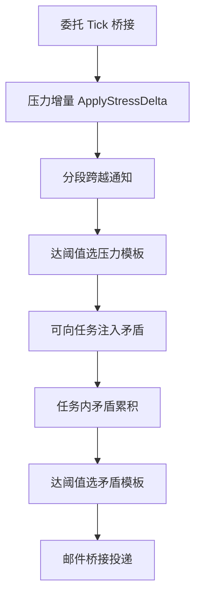

> 状态：草稿
> 校验状态：待校验
> 关联实现：[实现-压力系统](../04-实现/实现-压力系统.md)、[实现-矛盾系统](../04-实现/实现-矛盾系统.md)、[实现-运行时编排](../04-实现/实现-运行时编排.md)

# 压力与矛盾事件选取

本文记录压力事件与矛盾事件在运行时的选取顺序与去重占位。规则收束见 [需求-矛盾与压力事件选取](../../../02-系统设计/02-需求/需求-矛盾与压力事件选取.md)。

## 目标顺序（流程设计详情图）

## 代码落点

| 职责 | 当前 | 目标 |
|------|------|------|
| 选取顺序编排 | 模块内隐式链 | `Runtime/Crisis/CrisisEventCoordinator`（stub） |
| 压力规则 | `StressSystem` | 不变 |
| 矛盾规则 | `ConflictSystemService` | 不变 |

## 待确认

- 同一帧内压力事件与矛盾事件邮件去重。
- 满值性格失控与矛盾阈值同时满足的优先级。

## 修订记录

| 日期 | 版本 | 说明 |
|------|------|------|
| 2026-06-30 | 0.0.1 | 初稿：对齐 [流程设计详情图](../../../01-草稿/流程设计详情图.md) |

← [运行时逻辑](./README.md)
