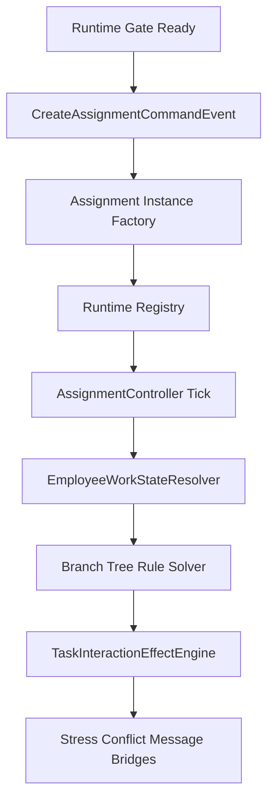

> 状态：草稿
> 校验状态：待校验
> 关联实现：[实现-委托系统](../04-实现/实现-委托系统.md)、[实现-员工与标签Buff](../04-实现/实现-员工与标签Buff.md)、[实现-矛盾系统](../04-实现/实现-矛盾系统.md)

# 委托 Tick 与分支判定

本文记录委托运行时推进的跨模块顺序。字段定义见 [委托与分支数据结构](../03-数据字典/委托与分支数据结构.md)。

## 管线

## 判定顺序

1. `AssignmentManager` 在门控放行后处理创建命令。
2. 实例工厂读取委托模板与分支树，生成运行时委托数据。
3. `AssignmentController` 在 Tick 中推进任务进度，并通过员工工作状态解析器读取员工状态。
4. 分支树规则先判断前置条件，再选择可进入分支。
5. 任务内效果由效果引擎统一执行，压力、矛盾、消息等模块通过桥接类接收结果。
6. 终态任务交给经济模块做幂等结算，避免重复发放奖励或重复扣除。

## 不变量

- 委托不得直接修改员工内部状态；员工状态变更须经 Employee 模块公开入口。
- 分支权重、触发条件、任务效果参数应来自 SO 或 `Assets/04_Data/`，不得散落在运行时代码中。
- 与 UI 或叙事相关的阶段 hook 只传 `hookId`，具体展示由消费方解释。

## 待确认事项

- 矛盾与压力事件选取仍需系统设计补全后固化到本管线。
- 地图与任务布点模块落地后，需要补充「地点刷新 → 委托创建」的上游入口。

## 修订记录

| 日期 | 版本 | 说明 |
|------|------|------|
| 2026-06-29 | 0.0.1 | 初稿：抽取委托 Tick 与分支判定顺序 |
