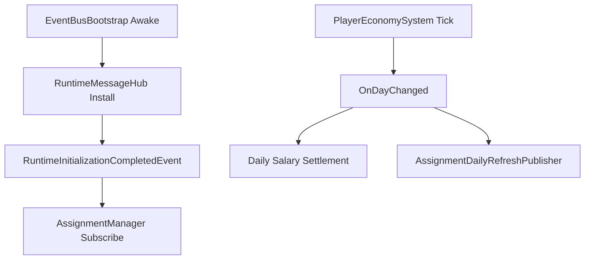

> 状态：草稿
> 校验状态：待校验
> 关联实现：[实现-核心消息与启动门控](../04-实现/实现-核心消息与启动门控.md)、[实现-玩家经济与日历时钟](../04-实现/实现-玩家经济与日历时钟.md)、[实现-委托系统](../04-实现/实现-委托系统.md)

# 日结与门控管线

本文记录启动门控、虚拟日推进、日结与日常委托刷新的运行时顺序。

## 执行顺序

## 关键规则

1. `EventBusBootstrap` 先安装全局消息总线，业务模块不得在总线未安装时直接发布全局消息。
2. 需要等待运行时就绪的模块监听 `RuntimeInitializationCompletedEvent`，并按 `gateKey` 判断是否放行。
3. `PlayerEconomySystem` 推进虚拟日；跨天时触发日结、薪资扣除、终态任务结算与 `OnDayChanged`。
4. 日常委托刷新订阅 `OnDayChanged`，只从标记为 `Daily` 的模板池发布新委托。
5. 测试场景可以通过专用 Bootstrap 模拟门控，但不得把测试门控默认挂入正式场景。

## 数据边界

| 数据 | 归属 |
|------|------|
| 门控消息与 `gateKey` | CoreMessaging |
| 虚拟日、资金、薪资缓存 | PlayerEconomy |
| 日常委托模板池 | Assignment + `Assets/04_Data/` |
| 员工日薪修正 | Employee 标签 Buff 通道 |

## 待确认事项

- 存档加载完成与 `RuntimeInitializationCompletedEvent` 的先后关系需要在存档模块落地时补充。
- 日结过程中压力、矛盾、消息派发的精确顺序应在对应模块联调后写入本页。

## 修订记录

| 日期 | 版本 | 说明 |
|------|------|------|
| 2026-06-29 | 0.0.1 | 初稿：抽取启动门控、日结与日常委托刷新顺序 |
