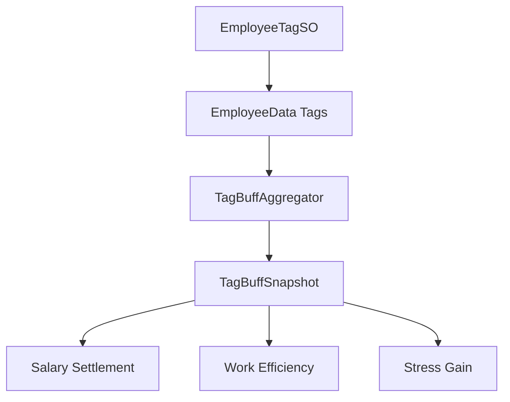

> 状态：草稿
> 校验状态：待校验
> 关联实现：[实现-员工与标签Buff](../04-实现/实现-员工与标签Buff.md)、[实现-玩家经济与日历时钟](../04-实现/实现-玩家经济与日历时钟.md)、[实现-委托系统](../04-实现/实现-委托系统.md)

# 标签 Buff 应用通道

本文记录员工标签 Buff 从配置到运行时消费的通道。字段定义见 [员工与标签数据结构](../03-数据字典/员工与标签数据结构.md)。

## 管线

## 规则

1. 标签配置由 `EmployeeTagSO` 与标签库维护；员工运行时只保存标签引用或标识。
2. `TagBuffAggregator` 负责从员工标签列表聚合 `TagBuffSnapshot`。
3. 快照按 `TagModifierChannel` 区分日薪、个人效率、压力获得等通道。
4. 消费模块只能读取聚合后的快照或公开解析接口，不得重复解析标签内部字段。
5. 需要展示来源时，应保留每个标签贡献项，避免 UI 只写固定说明文字。

## 消费边界

| 消费方 | 使用方式 |
|--------|----------|
| PlayerEconomy | 读取日薪修正，参与日结扣薪 |
| Assignment | 读取个人效率等工作相关修正 |
| Stress | 读取压力获得通道 |
| UI | 展示标签与 Buff 明细，不自行参与数值结算 |

## 待确认事项

- 若后续新增「标签临时效果」或限时 Buff，应先扩展数据字典，再补充本管线的生命周期。
- 压力与矛盾桥接需要在事件选取规则确定后补充来源展示要求。

## 修订记录

| 日期 | 版本 | 说明 |
|------|------|------|
| 2026-06-29 | 0.0.1 | 初稿：抽取员工标签 Buff 的应用通道 |
