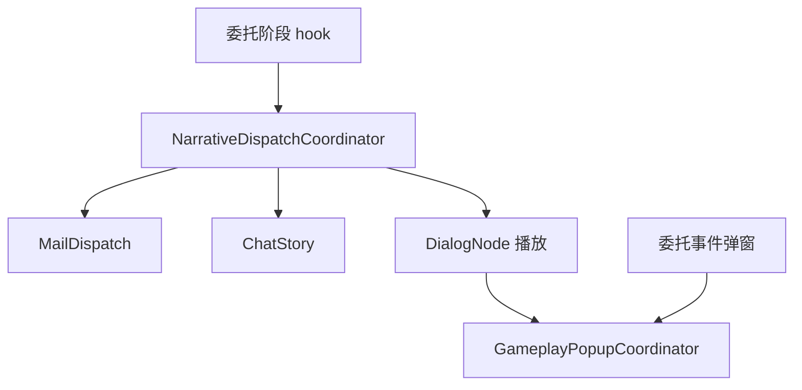

> 状态：草稿
> 校验状态：待校验
> 关联实现：[实现-消息系统](../04-实现/实现-消息系统.md)、[实现-对话播放系统](../04-实现/实现-对话播放系统.md)、[实现-界面壳层](../04-实现/实现-界面壳层.md)

# 消息与对话播放管线

本文记录阶段 hook、邮件/聊天/对话投递与弹窗优先级的协作顺序。对照 [交互链详情图](../../../01-草稿/交互链详情图.md)。

## 管线

## 规则（REQ-UI-002）

1. `DialogPlaybackController` 播放中设置 `GameplayPopupCoordinator.DialogPlaying = true`。
2. 玩法弹窗经 `RequestShow` 入队，对话结束后 `TryShowNext`。
3. `NarrativeDispatchCoordinator` 登记 hookId（stub），具体投递仍由各 Bridge 执行。

## 修订记录

| 日期 | 版本 | 说明 |
|------|------|------|
| 2026-06-30 | 0.0.1 | 初稿 |

← [运行时逻辑](./README.md)
