# 主线开局 · 思维导图（生产稿副本）

真值流程见 [PCM-01](../../设定真值/30-主角与主线/PCM-01-开局主线剧情流程.md)。下图仅用**节点颜色**区分类型（无分组框）。

**图例**

| 填色 | 类型 | 表现 |
|------|------|------|
| 黑底 | 入口 | 主线起点 |
| 灰白 | 剧情节拍 | 叙事衔接 |
| 蓝 | 教程 | 教学／引导 |
| 绿 | 任务内 | 委托运行中进度 |
| 黄 | 解锁功能 | 新系统开放 |

```mermaid
flowchart LR
  START([主线])

  W1[主角苏醒 · 林杜说明身份与使命]
  B2[指导玩家招募员工]
  W3[引荐摩恩女士]
  W4[摩恩女士委托：寻找一只猫]
  B5[指导玩家完成任务]

  G1[员工问邻居]
  G2[问到小孩追猫]
  G3[小孩带路]
  G4[进入废墟区]
  G5[废墟区边缘通风管道找猫]
  G6[找到猫 · 收队]
  G7[得到摩恩女士认可]

  W7[等待任务完成]
  Y8[解锁日常委托 · 服务科]

  D1[修水管]
  D2[捉奸]
  D3[找失物]

  B9[林杜：员工压力 · 配置休整]
  B10[任务内矛盾 · 玩家协调]
  W11[安排员工减少矛盾与压力]
  W12[引荐人力科主管霍尔特先生]
  Y13[解锁简历工作区]
  Y14[解锁常驻委托]

  START --> W1 --> B2 --> W3 --> W4 --> B5
  B5 --> G1 --> G2 --> G3 --> G4 --> G5 --> G6 --> G7 --> W7 --> Y8
  Y8 --> D1 & D2 & D3
  Y8 --> B9 --> B10 --> W11 --> W12 --> Y13 --> Y14

  classDef tutorial fill:#1951ed,color:#fff
  classDef mission fill:#46bb3a,color:#fff
  classDef unlock fill:#e3ba11,color:#1a1a1a
  classDef story fill:#f5f5f5,color:#1f2329,stroke:#646a73
  classDef start fill:#1f2329,color:#fff

  class B2,B5,B9,B10 tutorial
  class G1,G2,G3,G4,G5,G6,G7 mission
  class Y8,Y13,Y14 unlock
  class W1,W3,W4,W7,W11,W12,D1,D2,D3 story
  class START start
```

## 便签（实现备注）

| 文本 | 用途 |
|------|------|
| 你的杨婶 | 寻猫线街区 NPC 称谓（与摩恩引荐相关） |
| 0 点不让放入职位，对所有任务有效 | 零编制不可派遣，全局防死锁 |
| 此处包括指引玩家让员工休整 | 与序 9 教程同条 |
| 需要富文本高亮某些关键词 | 霍尔特引荐等教程文案格式 |
