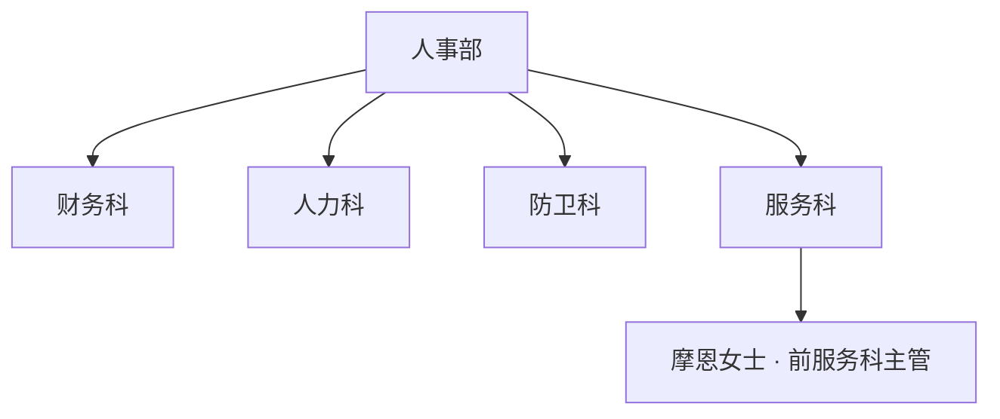

# 开局主线剧情流程（教程至功能解锁）

## 第一条　条文性质

本条收录**已拍板**的开局主线：自调度核心 **B-9002** 苏醒起，至**简历工作区**与**常驻委托**解锁为止的**流程顺序**与**节点类型**（教程／任务内／功能解锁）。具体台词、关卡配置与 UI 表现归入 [叙事生产稿/](../../叙事生产稿/README.md)；世界前史仍见 [TIM-04](../40-时序与历史/TIM-04-前管理者执政与第九区事态背景年表.md)、[SYS-PREV-BRIDGE](../10-百科/系统/SYS-PREV-BRIDGE-前任桥接体与第九区废墟事变.md)，**不**在本条展开。

主线长期压力与终局分型服从 [NAR-01](../20-叙事合同/NAR-01-主线张力与终局分型.md)。本条仅覆盖**开局引导段**。

## 第二条　节点类型与游戏表现

与白板参考图一致，三类节点对应不同**游戏内表现层级**（教程弹层、任务场景、系统解锁等由生产稿落实）：

| 类型 | 白板颜色 | 含义 | 表现要点（策划） |
|------|----------|------|------------------|
| **教程** | 蓝 | 系统教学、界面引导、规则说明 | 可打断任务流；强调「怎么做」 |
| **任务内** | 绿 | 发生在**已接取委托的运行中**，玩家操控编组推进 | 与场景、NPC、地点绑定；计为任务进度 |
| **解锁功能** | 黄 | 达成条件后开放新系统或新入口 | 常伴 UI 高亮、新菜单、新委托类型 |

白板上的**白色方框**为**剧情／衔接节拍**（叙事桥接，不一定单独对应一种 UI 类型）。**便签**（图中黄底小条）为**实现备注**或**与黄色解锁节点相关的补充说明**，不是独立流程步。

## 第三条　世界观提示（白板注释）

> 一个虚构的、将一座城市私有化的赛博朋克巨型企业的子实体：**人事部**。设有防卫科、财务科、人力科、服务科。主要职责是管理社区人员，代行当地市政职能。

制度锚点见 [ORG-HRDEPT](../10-百科/组织/赫利俄斯/ORG-HRDEPT-人类事务管理部.md)、[WLD-03](../00-基石/WLD-03-人事部分权结构总览.md)。寻猫委托人 **摩恩女士** 为前服务科科长，见 [CHR-MOEN](../10-百科/人物/CHR-MOEN-摩恩夫人.md)。

## 第四条　流程总表（顺序）

表中 **序** 为设计上的先后关系；**并行** 处见第五条思维导图。

| 序 | 类型 | 节点 | 说明 |
|----|------|------|------|
| 0 | — | **主线**（入口） | 开局主线链起点 |
| 1 | 剧情 | 主角苏醒；**林杜**说明身份与使命 | 监管／引导人出场；建立玩家为调度核心、隶属特殊综合行动小组（[SYS-B9002](../10-百科/系统/SYS-B9002-桥接体与调度核心职能.md)、[ORG-HRDEPT-SCO](../10-百科/组织/赫利俄斯/ORG-HRDEPT-SCO-特殊综合行动小组.md)） |
| 2 | 教程 | 指导玩家**招募员工** | 编组／人事基础操作 |
| 2a | 便签 | 「你的杨婶」 | 与寻猫线相关的街区 NPC 称谓备注（生产稿可与「梁婶」等名统一） |
| 3 | 剧情 | **引荐摩恩女士** | 外部委托人接入 |
| 4 | 剧情 | 摩恩女士**委托寻找一只猫** | 首个主线委托立项；归属**服务科**口径 |
| 5 | 教程 | 指导玩家**完成任务**（接取与派遣流程） | 与序 6 任务内链衔接 |
| 6a | 任务内 | 员工**问邻居** | 寻猫调查 |
| 6b | 任务内 | **问到小孩**（追猫线索） | |
| 6c | 任务内 | **让小孩带路** | |
| 6d | 任务内 | 带路来到**废墟区** | 接口 [PLC-RUINS](../10-百科/地点/PLC-RUINS-废墟区-第九区事变遗留片区.md) |
| 6e | 任务内 | 在废墟区边缘的**通风管道**找猫 | |
| 6f | 任务内 | **找到猫**，收队 | |
| 6g | 任务内 | 得到**摩恩女士的认可** | 首个委托闭环 |
| 7 | 剧情 | **等待任务完成**（结算／回传） | 系统层任务结算节拍 |
| 7a | 便签 | **无法推进的保险**：0 点不让放入职位，对所有任务有效 | 全局规则：零编制不可派遣，防死锁 |
| 8 | 解锁 | **解锁日常委托**（服务科） | 开放日常类委托入口 |
| 8a | 剧情 | 日常示例分支（并列示例，非严格顺序）：**修水管**、**捉奸**、**找失物** | 展示日常委托品类 |
| 9 | 教程 | 林杜说明**员工压力**；指导玩家**配置员工休整** | 压力／休整系统教学 |
| 10 | 教程 | 说明**任务内可能存在矛盾**，需要玩家**协调** | 四科／编组冲突规则入门 |
| 11 | 剧情 | 林杜指出：可通过**适当安排员工**减少矛盾／压力 | 与休整、岗位配置联动 |
| 11a | 便签 | 「此处包括指引玩家让员工休整」 | 与序 9 教程呼应 |
| 12 | 剧情 | 林杜**引荐人力部主管霍尔特先生** | 人力科线接入；真值层四科科长见 [CHR-SERENA-DAY](../10-百科/人物/CHR-SERENA-DAY-瑟琳娜·昼.md)，霍尔特是否为教程专用对接人由生产稿定 |
| 12a | 便签 | 需要**富文本高亮**某些关键词 | 教程文案呈现要求 |
| 13 | 解锁 | **解锁简历工作区** | 员工／人事深度管理入口 |
| 14 | 解锁 | **解锁常驻委托** | 长期委托池或同类系统 |

## 第五条　思维导图（还原参考图）

下列 Mermaid 图还原白板**主干左右顺序**与**寻猫任务内支链**；**仅用节点填色区分类型**，不使用 `subgraph` 分组框。颜色含义见**图例**。

**图例（颜色 → 游戏表现）**

| 填色 | 节点类型 | 游戏内表现 |
|------|----------|------------|
| 黑底 | 入口 | 主线链起点 |
| 灰白 | 剧情节拍 | 叙事衔接；不一定单独对应一种 UI |
| 蓝 | 教程 | 教学弹层、界面引导、规则说明 |
| 绿 | 任务内 | 已接委托运行中的场景进度 |
| 黄 | 解锁功能 | 新系统／新入口开放 |

```mermaid
flowchart LR
  START([主线])
  W1[主角苏醒 · 林杜说明身份与使命]
  B2[指导玩家招募员工]
  W3[引荐摩恩女士]
  W4[摩恩女士委托：寻找一只猫]
  B5[指导玩家完成任务]
  G1[员工问邻居]
  G2[问到小孩追猫]
  G3[小孩带路]
  G4[进入废墟区]
  G5[废墟区边缘通风管道找猫]
  G6[找到猫 · 收队]
  G7[得到摩恩女士认可]
  W7[等待任务完成]
  Y8[解锁日常委托 · 服务科]
  D1[修水管]
  D2[捉奸]
  D3[找失物]
  B9[林杜说明员工压力 · 配置员工休整]
  B10[说明任务内矛盾 · 需玩家协调]
  W11[林杜：安排员工可减少矛盾与压力]
  W12[林杜引荐人力科主管霍尔特先生]
  Y13[解锁简历工作区]
  Y14[解锁常驻委托]

  START --> W1 --> B2 --> W3 --> W4 --> B5
  B5 --> G1 --> G2 --> G3 --> G4 --> G5 --> G6 --> G7
  G7 --> W7 --> Y8
  Y8 --> D1 & D2 & D3
  Y8 --> B9 --> B10 --> W11 --> W12 --> Y13 --> Y14

  classDef tutorial fill:#1951ed,color:#fff,stroke:#0d3a9e
  classDef mission fill:#46bb3a,color:#fff,stroke:#2d7a24
  classDef unlock fill:#e3ba11,color:#1a1a1a,stroke:#a8840a
  classDef story fill:#f5f5f5,color:#1f2329,stroke:#646a73
  classDef start fill:#1f2329,color:#fff,stroke:#000

  class B2,B5,B9,B10 tutorial
  class G1,G2,G3,G4,G5,G6,G7 mission
  class Y8,Y13,Y14 unlock
  class W1,W3,W4,W7,W11,W12,D1,D2,D3 story
  class START start
```

**便签（图中黄底小条，不单独成节点）**

| 位置 | 文本 |
|------|------|
| 招募员工附近 | 你的杨婶 |
| 等待任务完成附近 | 无法推进的保险：0 点不让放入职位，对所有任务有效 |
| 安排员工减少矛盾附近 | 此处包括指引玩家让员工休整 |
| 引荐霍尔特附近 | 需要富文本高亮某些关键词 |

**组织示意图（白板左下，独立注释）**

## 第六条　与真值人物、地点的对应

| 流程元素 | 真值锚点 |
|----------|----------|
| 调度核心／玩家 | [SYS-B9002](../10-百科/系统/SYS-B9002-桥接体与调度核心职能.md) |
| 林杜 | 引导监管人（生产稿立项；草稿亦作「林都」，本条依参考图写作**林杜**） |
| 摩恩女士 | [CHR-MOEN](../10-百科/人物/CHR-MOEN-摩恩夫人.md) |
| 服务科寻猫 | [CHR-ISAAC-MOELLER](../10-百科/人物/CHR-ISAAC-MOELLER-艾萨克·穆尔.md) 所辖科室；废墟边缘见 [PLC-RUINS](../10-百科/地点/PLC-RUINS-废墟区-第九区事变遗留片区.md) |
| 霍尔特先生 | 人力科教程对接（与 [CHR-SERENA-DAY](../10-百科/人物/CHR-SERENA-DAY-瑟琳娜·昼.md) 关系由生产稿定） |
| 四科制度摩擦 | [WLD-03](../00-基石/WLD-03-人事部分权结构总览.md)、[四科冲突与剧情线索](../../叙事生产稿/01-简报/人物/四科冲突与剧情线索.md) |

## 第七条　范围外（本条不含）

- **反 AI 游行**及检察组、专家暗线等：见草稿 [引导任务与反AI游行支线_转写稿](../../../.草稿-编写正文时不许修改/引导任务与反AI游行支线_转写稿.md)，**尚未**纳入本条拍板流程。  
- 前任管理者、伊莱部长秘密等：P2–P3，非开局必经（[SYS-B9002](../10-百科/系统/SYS-B9002-桥接体与调度核心职能.md) 第七条）。

## 第八条　关联条文

- [PCM-00](PCM-00-使用范围与边界.md)  
- [NAR-00](../20-叙事合同/NAR-00-叙事母题与基调.md)、[NAR-01](../20-叙事合同/NAR-01-主线张力与终局分型.md)  
- [叙事生产稿/03-节拍/主线开局-思维导图.md](../../叙事生产稿/03-节拍/主线开局-思维导图.md)（本条导图的生产稿副本）
